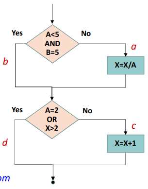
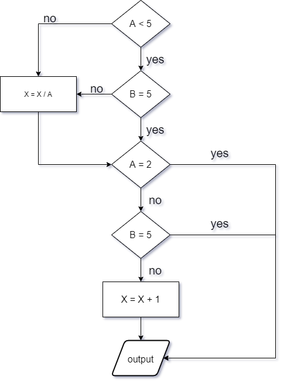
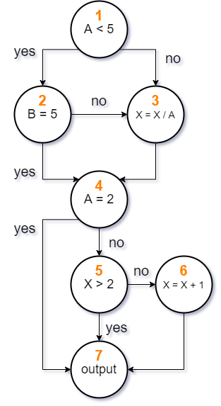

# Assignment 6

|  姓名  |   学号   |    学院    |   专业   |
| :----: | :------: | :--------: | :------: |
| 米家龙 | 18342075 | 计算机学院 | 软件工程 |

- [Assignment 6](#assignment-6)
  - [要求](#要求)
  - [实现](#实现)
    - [1. 转换单条件判定结构](#1-转换单条件判定结构)
    - [2. 画出相应的程序控制流图](#2-画出相应的程序控制流图)
    - [3. 给出控制流图的邻接矩阵](#3-给出控制流图的邻接矩阵)
    - [4. 计算 McCabe 环形复杂度](#4-计算-mccabe-环形复杂度)
    - [5. 找出程序的一个独立路径集合](#5-找出程序的一个独立路径集合)

## 要求

流程图如下：

根据流程图完成：

1. 转换单条件判定结构
2. 画出相应的程序控制流图
3. 给出控制流图的邻接矩阵
4. 计算 McCabe 环形复杂度
5. 找出程序的一个独立路径集合

## 实现

### 1. 转换单条件判定结构

具体如图：

### 2. 画出相应的程序控制流图

如下图：

### 3. 给出控制流图的邻接矩阵

$$
\begin{bmatrix}
  1 & 1 & 1 & 0 & 0 & 0 & 0 \\
  0 & 1 & 1 & 1 & 0 & 0 & 0 \\
  0 & 0 & 1 & 1 & 0 & 0 & 0 \\
  0 & 0 & 0 & 1 & 1 & 0 & 1 \\
  0 & 0 & 0 & 0 & 1 & 1 & 1 \\
  0 & 0 & 0 & 0 & 0 & 1 & 1 \\
  0 & 0 & 0 & 0 & 0 & 0 & 1 \\
\end{bmatrix}
$$

### 4. 计算 McCabe 环形复杂度

> **McCabe 环路复杂度**为程序逻辑复杂性提供定量测度。该度量用于计算程序的基本独立路径数目，也即是确保所有语句至少执行一次的起码测试数量。

控制流程图有7个节点10条边，即 $N = 7, \ E = 10$，因此：

$$
V(G) = m - n + 2 = 5
$$

控制流程途中有4个单判定节点，即 $P = 4$，因此：

$$
V(G) = d + 1 = 5
$$

### 5. 找出程序的一个独立路径集合

> **一条独立路径**是指，和其他的独立路径相比，至少引入一个新处理语句或一个新判断的程序通路。V(G) 值正好等于该程序的独立路径的条数。

- 1→2→4→7
- 1→2→3→4→7
- 1→2→4→5→7
- 1→2→4→5→6→7
- 1→3→4→7
