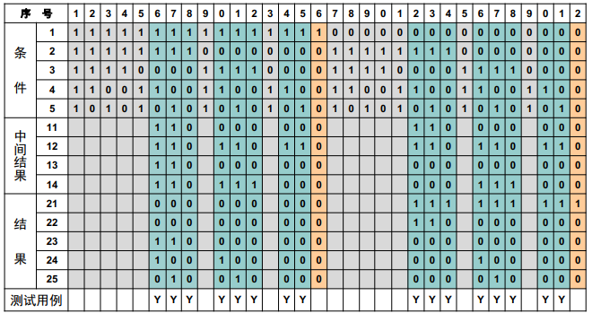

# Assignment 8

|  姓名  |   学号   |    学院    |   专业   |
| :----: | :------: | :--------: | :------: |
| 米家龙 | 18342075 | 计算机学院 | 软件工程 |

- [Assignment 8](#assignment-8)
  - [要求](#要求)
    - [测试用例](#测试用例)
    - [题目](#题目)
  - [解答](#解答)
    - [1. 输入条件的自然语义陈述](#1-输入条件的自然语义陈述)
    - [2. 输出结果的自然语义陈述](#2-输出结果的自然语义陈述)
    - [3. 判定规则 & 推理演算过程](#3-判定规则--推理演算过程)
      - [第6列](#第6列)
        - [第6列判定规则](#第6列判定规则)
        - [第6列推演过程](#第6列推演过程)
      - [第23列](#第23列)
        - [第23列判定规则](#第23列判定规则)
        - [第23列推演过程](#第23列推演过程)

## 要求

### 测试用例

设计处理单价为5角的饮料的自动售货机软件的测试用例。软件规格说明如下：

1. 操作者投入5角或1元的硬币，按下`橙汁`或`啤酒`的按钮，售货机送出相应的饮料 (不考虑饮料不足的情况)。
2. 若售货机没有零钱找，则一个显示`零钱找完` 的红灯亮。
   - 此时操作者投入1元硬币并按下按钮后，不送出饮料，而是退还1元硬币。
3. 若售货机有零钱找，则显示`零钱找完` 的红灯灭。
   - 此时操作者投入1元硬币并按下按钮后，售货机送出饮料，退还5角硬币。

### 题目

分析 Chap.5 (Lec.19) 自动售货机软件例子生成的判定表图例的**第6列**和**第23列**，分别给出：

1. 输入条件的自然语义陈述；
2. 输出结果的自然语义陈述；
3. 用命题逻辑形式描述实现上述输入-输出过程所应用的判定规则，并写出获得输出结果的推理演算过程。

## 解答

### 1. 输入条件的自然语义陈述

原因清单（输入条件）：

- $C_1$：售货机可找零
- $C_2$：投入1元硬币
- $C_3$：投入5角硬币
- $C_4$：按下`橙汁`按钮
- $C_5$：按下`啤酒`按钮

第6列：

$$
C_1 \ \text{售货机可找零} \rightarrow C_2 \ \text{投入1元硬币} \rightarrow C_4 \ \text{按下}{\color{orange}{\bf{橙汁}}}\text{按钮}
$$

第23列：

$$
\overline{C_1} \ \text{售货机无零可找} \rightarrow C_2 \ \text{投入1元硬币} \rightarrow C_5 \ \text{按下}{\color{orange}{\bf{啤酒}}}\text{按钮}
$$

### 2. 输出结果的自然语义陈述

结果清单（输出结果）：

- $E_{21}$：`零钱找完`灯亮
- $E_{22}$：退还1元硬币
- $E_{23}$：退还5角硬币
- $E_{24}$：送出`橙汁`饮料
- $E_{25}$：送出`啤酒`饮料

第6列：

$$
E_{23} \ \text{退还5角硬币} \rightarrow E_{24} \text{送出}{\color{orange}{\bf{橙汁}}}\text{饮料}
$$

第23列：

$$
E_{21} \ {\color{orange}{\bf{零钱找完}}} \text{灯亮} \rightarrow E_{22} \text{退还1元硬币}
$$

### 3. 判定规则 & 推理演算过程

#### 第6列

##### 第6列判定规则

$$
\begin{aligned}
  C_4 \vee C_5 & \Rightarrow T_{12} \\
  C_2 \wedge T_{12}  & \Rightarrow T_{11} \\
  C_1 \wedge T_{11} & \Rightarrow T_{13} \\
  C_3 \vee T_{13} & \Rightarrow T_{14} \\
  T_{13} & \Rightarrow E_{23} \\
  C_4 \wedge T_{14} & \Rightarrow E_{24}
\end{aligned}
$$

##### 第6列推演过程

以 $C_1$, $C_2$, $C_4$ 为前提，应用上述规则得到：

$$
\begin{aligned}
  T_{12} & = C_4 \vee C_5 = 1 \\
  T_{11} & = C_2 \wedge T_{12} = 1 \\
  T_{13} & = C_1 \wedge T_{11} = 1 \\
  T_{14} & = C_3 \vee T_{13} = 1 \\
  E_{23} & = T_{13} = 1 \\
  E_{24} & = C_4 \wedge T_{14} = 1
\end{aligned}
$$

由此证明 $E_{23}$ 和 $E_{24}$

#### 第23列

##### 第23列判定规则

$$
\begin{aligned}
  C_4 \vee C_5 & \Rightarrow T_{12} \\
  C_2 \wedge T_{12} & \Rightarrow T_{11} \\
  \overline{C_1} & \Rightarrow E_{21} \\
  \overline{C_1} \wedge T_{11} & \Rightarrow E_{22}
\end{aligned}
$$

##### 第23列推演过程

以 $\overline{C_1}$, $C_2$, $C_5$ 为前提，应用上述判定规则得到：

$$
\begin{aligned}
  T_{12} & = C_4 \vee C_5 = 1 \\
  T_{11} & = C_2 \wedge T_{12} = 1 \\
  E_{21} & = \overline{C_1} = 1 \\
  E_{22} & = \overline{C_1} \wedge T_{11} = 1
\end{aligned}
$$

由此证明 $E_{21}$ 和 $E_{22}$