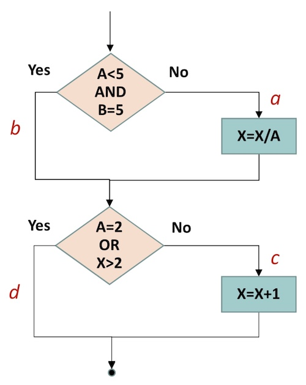

# 软件测试2021年期末考试题目

> 写在前面：全靠记忆和关键词记录

- [软件测试2021年期末考试题目](#软件测试2021年期末考试题目)
  - [名词解释](#名词解释)
  - [简答题](#简答题)
  - [论述题](#论述题)

## 名词解释

1. 软件危机
2. 软件验证（Software Varification）
3. 计算机软件配置项（CSCI）
4. 软件编码规范
5. 软件故障模型
6. Rayleigh 软件缺陷模型

## 简答题

1. 简述你对停止公理（Test never finishes; it stops.）的理解
2. 简述你对软件结构复杂性的理解
3. 简述黑盒测试和白盒测试的异同
4. 举例说明等价类划分的测试用例设计

## 论述题

1. 论述敏捷开发和传统软件工程方法的软件测试生命周期的异同
2. 根据下面的程序流程图，回答下列问题：
   1. 画出相应的程序控制流图
   2. 计算 McCabe 环形复杂度
   3. 找出程序的一个独立路径集合
   4. 根据独立路径设计测试用例

> 该题是19年期末原题+作业6原题，请参考[Chap.4 Assignment.6](../006/006.md)